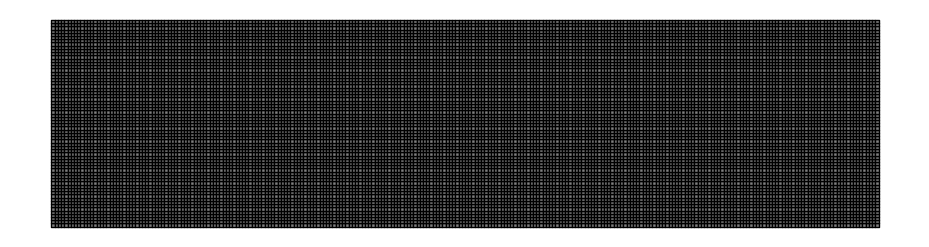
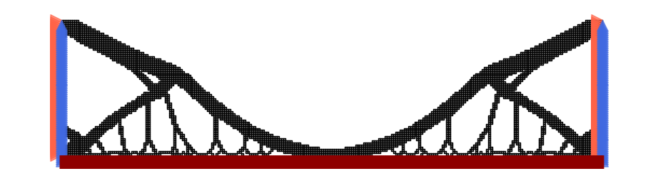
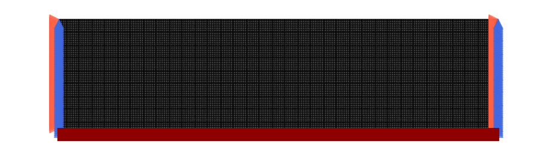
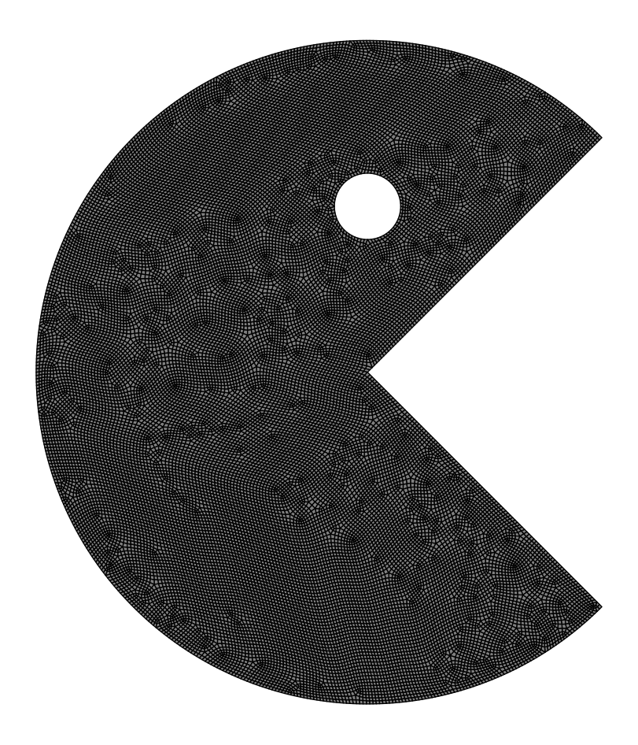
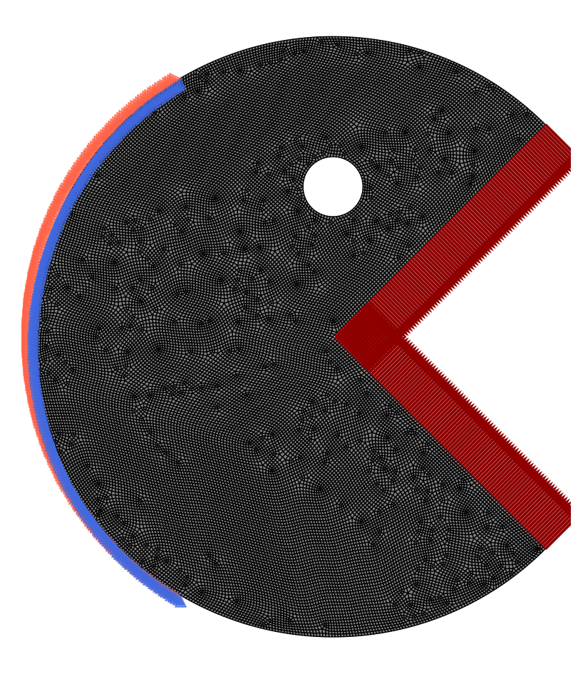
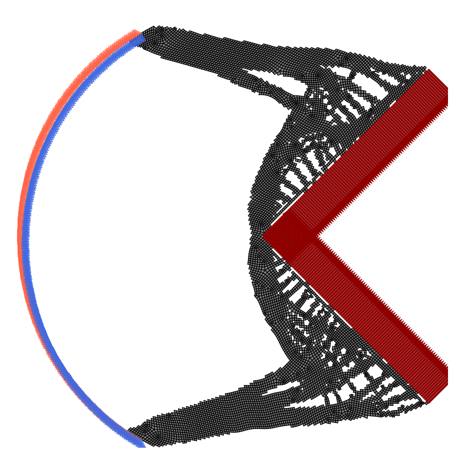

2D Topology Optimization Example
================================

Classic 2D Structured Meshes
-----------------------------

In this example we will show how you can use pyFANTOM to perform minimum compliance TO on **structured meshes** in 2D. For this example we will perform TO on the bridge problem.

Below we detail how you can do this in a few lines of code!

=============================
Importing The Necessary Tools
=============================

First we import the tools from pyFANTOM we will be using in this example.

.. code-block:: python

   from pyFANTOM.CPU import(
       StructuredMesh2D, # Mesh Object for 2D Structured Meshes
       StructuredFilter2D, # Filter kernel for 2D Structured Meshes
       StructuredStiffnessKernel, # Stiffness Kernel for 2D Structured Meshes
       FiniteElement, # Finite Element Object to Setup Boundary Conditions and RHS
       CHOLMOD, CG, GMRES, MultiGrid, SPLU, SPSOLVE, # Sparse Solvers
       MinimumCompliance, # TO Problem Definition
       PGD, MMA, OC # Nonlinear Optimizers
   )

   from pyFANTOM.Physics import LinearElasticity # Physics Model For FEA

   # Other Imports
   import numpy as np
   import matplotlib.pyplot as plt
   from tqdm import trange

===============================
Setting Up Physics and Geometry
===============================

The first step in using pyFANTOM is defining the domain of the problem and setting up the physics for FEA.

.. code-block:: python

   length = 1.0
   height = 0.25

   # Create a physics model
   physics = LinearElasticity(E=1.0, nu=1/3, thickness=1.0, type='PlaneStress')

   # Create a mesh
   mesh = StructuredMesh2D(nx=256, ny=64, lx=length, ly=height, physics=physics)

====================================
Setting Up The Finite Element Solver
====================================

The next step in using pyFANTOM is setting up a stiffness kernel and finite-element boundary conditions.

.. code-block:: python

   # Create a stiffness kernel
   stiffness_kernel = StructuredStiffnessKernel(mesh=mesh)

   # Create a solver
   solver = CHOLMOD(kernel=stiffness_kernel) # This can be any of the sparse solvers in pyFANTOM

   # Create a finite-element object
   fe = FiniteElement(mesh=mesh, kernel=stiffness_kernel, solver=solver)

   # Visualize the problem
   plt.figure(figsize=(10, 5))
   fe.visualize_problem()
   plt.tight_layout()
   plt.axis('off')

As seen above we do not have loads or boundary conditions. So now we will set this up for the bridge problem:

.. code-block:: python

   left_edge_nodes = np.where(mesh.nodes[:, 0] < 1e-12)[0]
   right_edge_nodes = np.where(mesh.nodes[:, 0] > length - 1e-12)[0]

   bottom_edge_nodes = np.where(mesh.nodes[:, 1] < 1e-12)[0]

   fe.reset_dirichlet_boundary_conditions()
   fe.reset_forces()
   # Apply force to the bottom edge
   fe.add_point_forces(
       node_ids=bottom_edge_nodes,
       positions=None,
       forces=np.array([[0.0, -1.0/len(bottom_edge_nodes)]])
   )

   # Apply zero displacement to the left edge and the right edge
   fe.add_dirichlet_boundary_condition(
       node_ids=np.concatenate([left_edge_nodes, right_edge_nodes]), # Node IDs to apply the boundary condition to
       positions=None, # Alternative way to specify the boundary condition is to pass positions in space
       dofs=np.array([[1, 1]]), # Degrees of freedom to apply the boundary condition to
       rhs=0.0 # Value to apply the boundary condition to
   )

   # Visualize the problem
   plt.figure(figsize=(10, 5))
   fe.visualize_problem()
   plt.tight_layout()
   # plt.autoscale(enable=True)
   plt.margins(0.12)
   plt.axis('off')

.. image:: ../_static/2DExample/2.png
   :alt: Problem with boundary conditions
   :align: center

====================================
Setting Up TO Problem And Optimizer
====================================

Once the finite element is setup we can define the problem and optimizer to perform TO.

.. code-block:: python

   # Define the filter kernel for TO
   filter_kernel = StructuredFilter2D(mesh=mesh, r_min=1.5)

   # Define the TO problem
   to_problem = MinimumCompliance(
       FE=fe,
       filter=filter_kernel,
       E_mul=[1.0], # You can pass a list of values to perform multi-material TO
       volume_fraction=[0.2], # You can pass a list of values to perform volume fraction control for each material
       void=1e-9, # You can pass a value to set void modulus
       penalty=3, # You can pass a value to set penalty factor
       #penalty_schedule = lambda p, i: (p-1)*np.round(4 * min(100, i) / 100)/4 + 1, # You can pass a function to set penalty schedule here 
       heavyside= True, # You can pass a boolean to use heavyside or not
       eta=0.5, # You can pass a value to set eta - only used for heavyside
       beta=2.0, # You can pass a value to set beta, or a function of iteration to set beta schedule - only used for heavyside
   )

   # Define the optimizer
   optimizer = PGD( # You can use any of the optimizers in pyFANTOM: OC, MMA, PGD
       problem=to_problem,
       change_tol=np.inf, # No change tolerance
       fun_tol=1e-4, # Function tolerance (convergence criterion for the optimizer)
   )

====================================
Running The Optimization Loop
====================================

Now we can run the optimization loop and perform TO.

.. code-block:: python

   maximum_iterations = 300

   Progressbar = trange(maximum_iterations, desc='Optimizer Iterations', leave=True)
   objective_history = []
   for i in Progressbar:
       optimizer.iter()
       
       Progressbar.set_postfix(
           optimizer.logs()
       )
       
       objective_history.append(optimizer.logs()['objective'])
       
       if optimizer.converged():
           print(f'Converged in {i} iterations')
           break

The optimization converged in 56 iterations with the following output:

::

   Optimizer Iterations:  19%|█▊        | 56/300 [01:04<04:40,  1.15s/it, objective=11.6, variable change=0.936, function change=5.92e-5, iteration=58, residual=2.56e-12] Converged in 56 iterations

Now we can visualize the resulting topology:

.. code-block:: python

   plt.figure(figsize=(10, 5))
   to_problem.visualize_solution()
   plt.tight_layout()
   # plt.autoscale(enable=True)
   plt.margins(0.1)
   plt.axis('off')

Running on GPU
--------------

The exact same problem can be run on GPU by just switching the backend. 

A few notes on CUDA back-ends:
- In general the only exact solver available for CUDA is SPSOLVE, but in general for structured meshes the Multi-Grid solver with our custom CUDA kernels is the fastest solver on GPU.
- The CUDA backend uses cupy, however, the inputs to the FE class can be numpy arrays.

.. code-block:: python

   from pyFANTOM.CUDA import(
       StructuredMesh2D, # Mesh Object for 2D Structured Meshes
       StructuredFilter2D, # Filter kernel for 2D Structured Meshes
       StructuredStiffnessKernel, # Stiffness Kernel for 2D Structured Meshes
       FiniteElement, # Finite Element Object to Setup Boundary Conditions and RHS
       CG, GMRES, MultiGrid, SPSOLVE, # Sparse Solvers
       MinimumCompliance, # TO Problem Definition
       PGD, MMA, OC # Nonlinear Optimizers
   )

   from pyFANTOM.Physics import LinearElasticity # Physics Model For FEA

   # Other Imports
   import numpy as np
   import matplotlib.pyplot as plt
   from tqdm import trange

   length = 1.0
   height = 0.25

   # Create a physics model
   physics = LinearElasticity(E=1.0, nu=1/3, thickness=1.0, type='PlaneStress')

   # Create a mesh
   mesh = StructuredMesh2D(nx=256, ny=64, lx=length, ly=height, physics=physics)

   # Create a stiffness kernel
   stiffness_kernel = StructuredStiffnessKernel(mesh = mesh)

   # Create a solver
   solver = MultiGrid(
       mesh=mesh,
       kernel=stiffness_kernel,
       maxiter=200,
       tol=1e-4,
       n_level=3,
       cycle='W',
       w_level=1
   )

   # Create a finite-element object
   fe = FiniteElement(mesh=mesh, kernel=stiffness_kernel, solver=solver)

   left_edge_nodes = np.where(mesh.nodes[:, 0] < 1e-12)[0]
   right_edge_nodes = np.where(mesh.nodes[:, 0] > length - 1e-12)[0]

   bottom_edge_nodes = np.where(mesh.nodes[:, 1] < 1e-12)[0]

   fe.reset_dirichlet_boundary_conditions()
   fe.reset_forces()
   # Apply force to the bottom edge
   fe.add_point_forces(
       node_ids=bottom_edge_nodes,
       positions=None,
       forces=np.array([[0.0, -1.0/len(bottom_edge_nodes)]])
   )

   # Apply zero displacement to the left edge and the right edge
   fe.add_dirichlet_boundary_condition(
       node_ids=np.concatenate([left_edge_nodes, right_edge_nodes]), # Node IDs to apply the boundary condition to
       positions=None, # Alternative way to specify the boundary condition is to pass positions in space
       dofs=np.array([[1, 1]]), # Degrees of freedom to apply the boundary condition to
       rhs=0.0 # Value to apply the boundary condition to
   )

   # Define the filter kernel for TO
   filter_kernel = StructuredFilter2D(mesh=mesh, r_min=1.5)

   # Define the TO problem
   to_problem = MinimumCompliance(
       FE=fe,
       filter=filter_kernel,
       E_mul=[1.0], # You can pass a list of values to perform multi-material TO
       volume_fraction=[0.2], # You can pass a list of values to perform volume fraction control for each material
       void=1e-9, # You can pass a value to set void modulus
       penalty=3, # You can pass a value to set penalty factor
       #penalty_schedule = lambda p, i: (p-1)*np.round(4 * min(100, i) / 100)/4 + 1, # You can pass a function to set penalty schedule here 
       heavyside= True, # You can pass a boolean to use heavyside or not
       eta=0.5, # You can pass a value to set eta - only used for heavyside
       beta=2.0, # You can pass a value to set beta, or a function of iteration to set beta schedule - only used for heavyside
   )

   # Define the optimizer
   optimizer = PGD( # You can use any of the optimizers in pyFANTOM: OC, MMA, PGD
       problem=to_problem,
       change_tol=np.inf, # No change tolerance
       fun_tol=1e-4, # Function tolerance (convergence criterion for the optimizer)
   )

   # Visualize the problem
   plt.figure(figsize=(10, 5))
   fe.visualize_problem()
   plt.tight_layout()
   # plt.autoscale(enable=True)
   plt.margins(0.12)
   plt.axis('off')

.. code-block:: python

   maximum_iterations = 300

   Progressbar = trange(maximum_iterations, desc='Optimizer Iterations', leave=True)
   objective_history = []
   for i in Progressbar:
       optimizer.iter()
       
       Progressbar.set_postfix(
           optimizer.logs()
       )
       
       objective_history.append(optimizer.logs()['objective'])
       
       if optimizer.converged():
           print(f'Converged in {i} iterations')
           break

The GPU optimization converged in 43 iterations:

::

   Optimizer Iterations:  14%|█▍        | 43/300 [00:09<00:55,  4.63it/s, objective=11.7, variable change=2, function change=2.32e-5, iteration=45, residual=8.85e-5]     Converged in 43 iterations

.. code-block:: python

   plt.figure(figsize=(10, 5))
   to_problem.visualize_solution()
   plt.tight_layout()
   # plt.autoscale(enable=True)
   plt.margins(0.1)
   plt.axis('off')

Unstructured Meshes
-------------------

pyFANTOM also supports unstructured meshes for topology optimization. Below we will use pygmesh to mesh a 2D model and perform TO on it. 

**NOTE:**
- This is a toy problem to represent the capabilities of the package not a real-world problem.
- The Multi-Grid solver which is the most efficient way to solve the FEA problem is only available for structured meshes. So you may want to consider voxelizing geometry in some cases.

.. code-block:: python

   from pyFANTOM.CPU import(
       GeneralMesh, # Mesh Object for Unstructured Meshes
       GeneralFilter, # Filter kernel for Unstructured Meshes
       GeneralStiffnessKernel, UniformStiffnessKernel, # Stiffness Kernel for Unstructured Meshes
       FiniteElement, # Finite Element Object to Setup Boundary Conditions and RHS
       CHOLMOD, CG, GMRES, MultiGrid, SPLU, SPSOLVE, # Sparse Solvers
       MinimumCompliance, # TO Problem Definition
       PGD, MMA, OC # Nonlinear Optimizers
   )

   from pyFANTOM.Physics import LinearElasticity # Physics Model For FEA

   import pygmsh

   # Other Imports
   import numpy as np
   import matplotlib.pyplot as plt
   from tqdm import trange

=====================
Create A Pac-Man Mesh
=====================

Below we will make a toy problem mesh using pygmesh.

.. code-block:: python

   # Unstructured Uniform Mesh generate on a random domain
   with pygmsh.geo.Geometry(['-setnumber', 'Mesh.Algorithm', '6',
                             '-setnumber', 'Mesh.RecombinationAlgorithm', '3',
                             '-setnumber', 'Mesh.RecombineAll', '1',
                             '-setnumber', 'Mesh.SaveWithoutOrphans', '1']) as geom:
       # Pacman parameters
       body_center = [0.5, 0.5, 0.0]
       body_radius = 0.5
       mouth_angle = 45  # Half-angle for the mouth (in degrees)
       eye_center = [0.5, 0.75, 0.0]
       eye_radius = 0.05

       # Define the mouth as a wedge
       p1 = geom.add_point(
           [
               body_center[0] + body_radius * np.cos(-np.pi/4),
               body_center[1] + body_radius * np.sin(-np.pi/4),
               0.0,
           ],
           mesh_size = 0.005
       )
       p2 = geom.add_point(
           [
               body_center[0] + body_radius * np.cos(np.pi/4),
               body_center[1] + body_radius * np.sin(np.pi/4),
               0.0,
           ],
           mesh_size = 0.005
       )
       p3 = geom.add_point(
           [
               0.0,
               0.5,
               0.0,
           ],
           mesh_size = 0.005
       )
       center_point = geom.add_point(body_center, mesh_size = 0.005)
       
       mouth_line1 = geom.add_line(center_point, p2)
       mouth_line2 = geom.add_line(p1, center_point)
       arc1 = geom.add_circle_arc(p2, center_point, p3)
       arc2 = geom.add_circle_arc(p3, center_point, p1)
       
       loop = geom.add_curve_loop([mouth_line1, arc1, arc2, mouth_line2])
       
       eye_center_point = geom.add_point(eye_center,
           mesh_size = 0.005)
       eye_right_point = geom.add_point([eye_center[0] + eye_radius, eye_center[1], 0.0],
           mesh_size = 0.005)
       eye_left_point = geom.add_point([eye_center[0] - eye_radius, eye_center[1], 0.0],
           mesh_size = 0.005)
       eye_arc1 = geom.add_circle_arc(eye_right_point, eye_center_point, eye_left_point,)
       eye_arc2 = geom.add_circle_arc(eye_left_point, eye_center_point, eye_right_point)
       
       eye_loop = geom.add_curve_loop([eye_arc1, eye_arc2])
       
       surface = geom.add_plane_surface(loop, holes=[eye_loop])
       
       # Generate the mesh
       mesh_uniform = geom.generate_mesh()

       mesh_uniform = [mesh_uniform.points[:,0:2], mesh_uniform.cells[1].data.astype(int).tolist()]

.. code-block:: python

   # Create a physics model
   physics = LinearElasticity(E=1.0, nu=1/3, thickness=1.0, type='PlaneStress')
   mesh = GeneralMesh(np.array(mesh_uniform[0]), np.array(mesh_uniform[1]), physics=physics)

   # Create a stiffness kernel
   if mesh.is_uniform:
       stiffness_kernel = UniformStiffnessKernel(mesh=mesh)
   else:
       stiffness_kernel = GeneralStiffnessKernel(mesh=mesh) 

   # Create a solver
   solver = CHOLMOD(kernel=stiffness_kernel)

   # Create a finite-element object
   fe = FiniteElement(mesh=mesh, kernel=stiffness_kernel, solver=solver)

   # Visualize the mesh
   plt.figure(figsize=(10, 10))
   fe.visualize_problem()
   plt.tight_layout()
   plt.axis('off')

Now we will setup boundary conditions for this toy problem:

.. code-block:: python

   fe.reset_dirichlet_boundary_conditions()
   fe.reset_forces()

   # find nodes on the boundary of the packman circle
   bc_nodes = np.isclose(np.linalg.norm(mesh.nodes[:,0:2] - np.array([0.5,0.5]), axis=1),0.5)
   bc_nodes = np.logical_and(bc_nodes, mesh.nodes[:,0] < 0.25)
   bc_nodes = np.where(bc_nodes)[0]

   fe.add_dirichlet_boundary_condition(
       node_ids=bc_nodes,
       positions=None,
       dofs=np.array([[1, 1]]),
       rhs=0.0
   )

   # apply load at the mouth of the packman
   upper_mouth = np.logical_and(np.isclose(np.abs(np.dot(mesh.nodes,np.array([-1,1]))),0), mesh.nodes[:,0] > 0.5)
   force_node = np.where(upper_mouth)[0]
   force_nodes = force_node[np.isin(force_node, bc_nodes, invert=True)]
   force = np.array([[1,-1]])/force_nodes.shape[0]/4 # Broadcastable, If needed you can provide one for each point

   fe.add_point_forces(
       node_ids=force_nodes,
       positions=None,
       forces=force
   )

   lower_mouth = np.logical_and(np.isclose(np.abs(np.dot(mesh.nodes,np.array([1,1]))),1.0), mesh.nodes[:,0] > 0.5)
   force_node = np.where(lower_mouth)[0]
   force_nodes = force_node[np.isin(force_node, bc_nodes, invert=True)]
   force = np.array([[1,1]])/force_nodes.shape[0]/4 # Broadcastable, If needed you can provide one for each point

   fe.add_point_forces(
       node_ids=force_nodes,
       positions=None,
       forces=force
   )

   # Visualize the problem
   plt.figure(figsize=(10, 10))
   fe.visualize_problem()
   plt.tight_layout()
   plt.axis('off')

Now we can just setup the problem and optimizer like before:

.. code-block:: python

   # Define the filter kernel for TO
   filter_kernel = GeneralFilter(mesh=mesh, r_min=2.0 * 0.005) # In general cases r_min is mesh space, not scaled by mesh size be cassreful!

   # Define the TO problem
   to_problem = MinimumCompliance(
       FE=fe,
       filter=filter_kernel,
       E_mul=[1.0], # You can pass a list of values to perform multi-material TO
       volume_fraction=[0.25], # You can pass a list of values to perform volume fraction control for each material
       void=1e-9, # You can pass a value to set void modulus
       penalty=3, # You can pass a value to set penalty factor
       #penalty_schedule = lambda p, i: (p-1)*np.round(4 * min(100, i) / 100)/4 + 1, # You can pass a function to set penalty schedule here 
       heavyside= True, # You can pass a boolean to use heavyside or not
       eta=0.5, # You can pass a value to set eta - only used for heavyside
       beta=2.0, # You can pass a value to set beta, or a function of iteration to set beta schedule - only used for heavyside
   )

   # Define the optimizer
   optimizer = PGD( # You can use any of the optimizers in pyFANTOM: OC, MMA, PGD
       problem=to_problem,
       change_tol=np.inf, # No change tolerance
       fun_tol=1e-4, # Function tolerance (convergence criterion for the optimizer)
   )

.. code-block:: python

   maximum_iterations = 300

   Progressbar = trange(maximum_iterations, desc='Optimizer Iterations', leave=True)
   objective_history = []
   for i in Progressbar:
       optimizer.iter()
       
       Progressbar.set_postfix(
           optimizer.logs()
       )
       
       objective_history.append(optimizer.logs()['objective'])
       
       if optimizer.converged():
           print(f'Converged in {i} iterations')
           break

The unstructured mesh optimization converged in 198 iterations:

::

   Optimizer Iterations:  66%|██████▌   | 198/300 [08:03<04:09,  2.44s/it, objective=1.47, variable change=0.12, function change=9.93e-5, iteration=200, residual=9.82e-13]  Converged in 198 iterations

.. code-block:: python

   # Visualize the solution
   plt.figure(figsize=(10, 10))
   to_problem.visualize_solution()
   plt.tight_layout()
   plt.axis('off')

